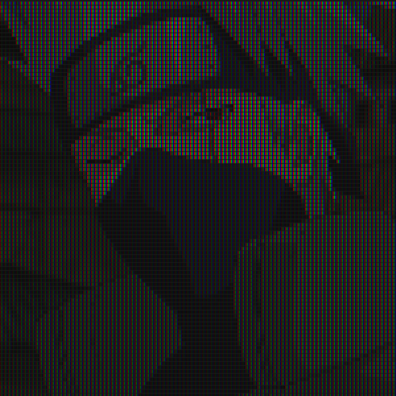

# BigPx

This Processing sketch transforms live video input to use larger pixels that show off the trippy effect of additive light using RGB bigPxs.

## Example

Here is an example of the bigPx effect:

### Original Image

### BigPx Effect

## Features

- Live webcam feed transformation
- Fullscreen immersive display
- Real-time video processing
- Smooth resolution scaling

## Controls

- **UP Arrow:** Increase pixel size for a more abstract look
- **DOWN Arrow:** Decrease pixel size for more detail

## Setup

1. Install Processing from [processing.org](https://processing.org/)
2. Install the Video library through Processing's Contribution Manager
3. Open ASCII.pde in Processing and run the sketch

## How it works

The sketch captures video from your webcam and redraws each frame as a grid of bigPxs. The resolution automatically adjusts based on the pixel size, creating a balance between performance and visual quality. Each pixel samples color from the corresponding position in the video feed, resulting in a real-time pixelated visualization.